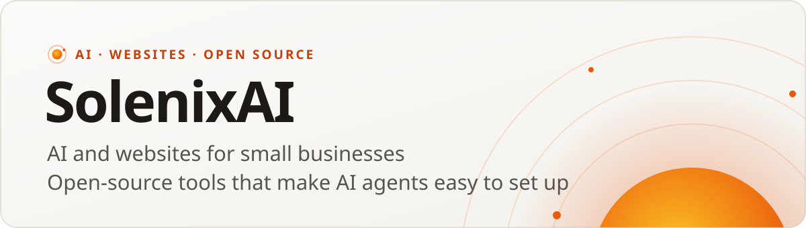

<picture>
  <source media="(prefers-color-scheme: dark)" srcset="assets/banner-org-dark.svg">
  
</picture>

**SolenixAI** helps small businesses put AI and the web to work, and builds open-source tools that make AI agents easy to set up.

### What we build

- **One-command agent setup** *(coming soon)*. Install a chosen set of MCP servers and skills into any MCP client with one command. Uninstall leaves no trace.

### Work with us

- **AI consulting for small businesses.** We find the hours AI can save you, then set it up so it keeps working.
- **Websites, done for you.** Built, launched on your own domain, and looked after.

→ [solenix.dev](https://solenix.dev) · [hello@solenix.dev](mailto:hello@solenix.dev)

### Contribute

Issues and pull requests are welcome. Please read our [contributing guide](https://github.com/SolenixAI/.github/blob/main/CONTRIBUTING.md), [code of conduct](https://github.com/SolenixAI/.github/blob/main/CODE_OF_CONDUCT.md) and [security policy](https://github.com/SolenixAI/.github/blob/main/SECURITY.md).
